<div align="center">





</div>

&nbsp;

пока все обновляют страницу руками — этот уже отправил уведомление.

> **не спит. не устаёт. не пропускает.**

написан на go — компилируется за секунду, **весит 15mb, летит быстрее чем ты успел подумать.**

&nbsp;



> **если появилось — уведомление уже отправлено.**

---

&nbsp;

<sub>четыре источника. один файл. ноль пропусков.</sub>

## С И Г Н А Л Ы



&nbsp;

**· axs.com** — AXS рендерит страницу через Next.js SSR. весь стейт лежит в `__NEXT_DATA__` JSON прямо в HTML. парсим три источника внутри:

```
performerEventsData.eventItems[]      — публичные листинги событий
teamUpcomingEventData.upcomingEvent   — предстоящее событие команды
discoveryPerformerData.events[]       — индекс поиска
```

если хоть в одном источнике появился ID, которого нет в базе — **алерт.**

дополнительный сигнал: Queue-it. когда AXS начинает пускать трафик через очередь (`queueit-overlay`, `inqueue.queue-it.net`) — это значит **страница под нагрузкой. билеты живые.** детектим и это тоже.

fallback: regex по raw HTML если `__NEXT_DATA__` вдруг исчезнет.

&nbsp;

**· steam news** — Valve анонсирует всё через Steam News API раньше чем открывает продажу. слушаем appid 570 (Dota 2), двухступенчатый матч:

```
ticketSignals (любой): tickets · ticket sale · on sale · presale · pre-sale · spectator pass · viewer pass · axs
eventSignals  (любой): the international · ti 2026 · ti2026
```

оба условия должны совпасть — и про билеты, и про событие. ложных срабатываний нет.

&nbsp;

***самый ранний возможный сигнал.***
***раньше axs. раньше твиттера.***

&nbsp;

**· reddit** — r/DotA2 Atom RSS. новые посты матчим по тем же ключевым фразам что и steam. независимый канал — если Valve или комьюнити опубликуют что-то раньше официального тикетинга, поймаем.

&nbsp;

все мониторы дедуплицируют через bbolt: **ID попал в базу → больше никогда не триггернёт.**

после первого анонса — режим ускоренного опроса: **1 минута вместо базового интервала, 72 часа.**

> **один раз. только один раз.**

---

&nbsp;

<sub>каждый выбор — под конкретное ограничение.</sub>

## П О Ч Е М У  Т А К



&nbsp;

<kbd>Go</kbd>
`go build` → статический бинарь → `COPY` в `FROM scratch` → 15MB образ без libc, без python, без ничего. `time.Ticker` + горутины закрывают задачу конкурентного поллинга без async/await и колбэк-ада. stdlib покрывает 90% проекта. сборка за секунду.

<kbd>bbolt</kbd>
дедупликация — это задача на принадлежность множеству. bbolt — embedded B-tree от etcd. **ноль инфраструктуры, ноль миграций,** данные живут в файле рядом с бинарём. переживает любой рестарт.

<kbd>tls-client</kbd>
стандартный `net/http` шлёт TLS ClientHello который не похож ни на один браузер. Cloudflare ставит Bot Score → block. tls-client патчит fingerprint под Chrome 120 — **проблема исчезает до того как запрос дошёл до логики приложения.**

<kbd>FlareSolverr</kbd>
headless Chrome для JS-челленджей. AXS использует Next.js SSR поэтому обычно не нужен. присутствует как страховка.

> **один бинарь. нет рантайма. нет зависимостей. FROM scratch.**

---

&nbsp;

## З А П У С К



&nbsp;

```bash
cp .env.example .env
# заполни TELEGRAM_BOT_TOKEN и ADMIN_CHAT_ID

docker compose up -d

# с flaresolverr:
docker compose --profile flaresolverr up -d
```

&nbsp;

```bash
# ─── обязательно ──────────────────────────────────────────────────
TELEGRAM_BOT_TOKEN=              # @BotFather
ADMIN_CHAT_ID=                   # твой chat id · ошибки сюда

# ─── поллинг ──────────────────────────────────────────────────────
POLL_INTERVAL_MINUTES=2          # после анонса → 1мин / 72ч

# ─── источники ────────────────────────────────────────────────────
AXS_HUB_URL=axs.com/teams/1119906/...     # хаб TI 2026
STEAM_NEWS_URL=steampowered.com/api/...   # appid 570

# ─── инфраструктура ───────────────────────────────────────────────
FLARESOLVERR_URL=http://localhost:8191    # опционально · js-челленджи
DB_PATH=./data/bot.db                    # переживает рестарты
```

---

&nbsp;

## П У Л Ь Т  У П Р А В Л Е Н И Я



---

&nbsp;

## Р О Д О С Л О В Н А Я



---

&nbsp;

<div align="center">



</div>
