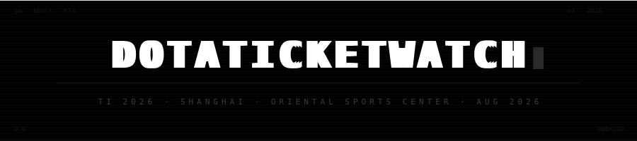
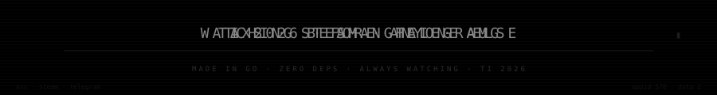
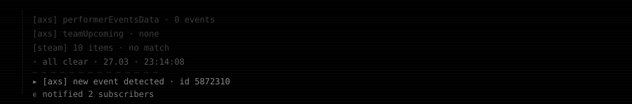
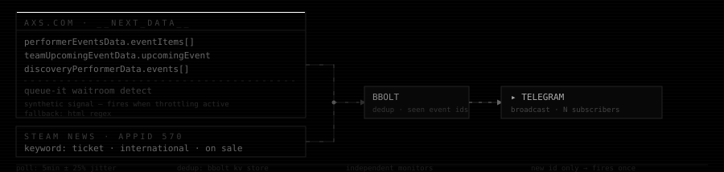
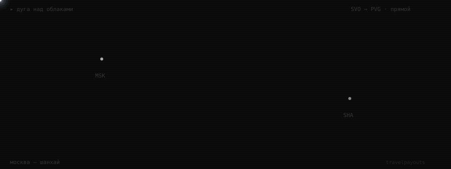
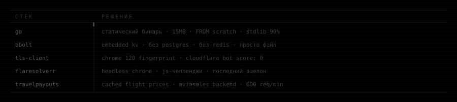
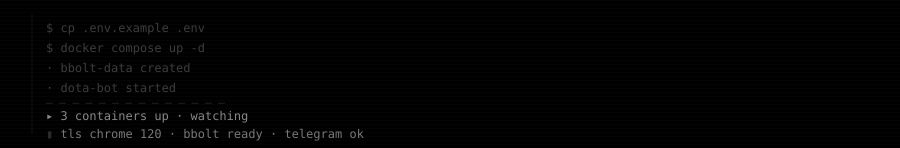
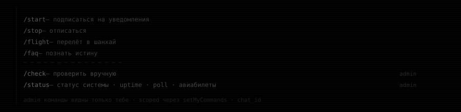
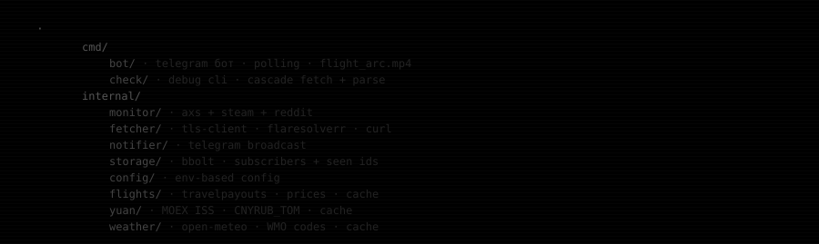

<div align="center">





</div>

&nbsp;

пока все обновляют страницу руками — этот уже отправил уведомление.

> **не спит. не устаёт. не пропускает.**

написан на go — компилируется за секунду, **весит 15mb, летит быстрее чем ты успел подумать.**

&nbsp;



> **если появилось — уведомление уже отправлено.**

---

&nbsp;

> **четыре источника. один файл. ноль пропусков.**

## С И Г Н А Л Ы



&nbsp;

**· axs.com** — AXS рендерит страницу через Next.js SSR. весь стейт лежит в `__NEXT_DATA__` JSON прямо в HTML. парсим три источника внутри:

```
performerEventsData.eventItems[]      — публичные листинги событий
teamUpcomingEventData.upcomingEvent   — предстоящее событие команды
discoveryPerformerData.events[]       — индекс поиска
```

если хоть в одном источнике появился ID, которого нет в базе — **алерт.**

дополнительный сигнал: Queue-it. когда AXS начинает пускать трафик через очередь (`queueit-overlay`, `inqueue.queue-it.net`) — это значит **страница под нагрузкой. билеты живые.** детектим и это тоже.

дополнительный слой: regex по raw HTML — работает всегда поверх JSON-парсинга, дубли отсеиваются.

&nbsp;

**· steam news** — Valve анонсирует всё через Steam News API раньше чем открывает продажу. слушаем appid 570 (Dota 2), двухступенчатый матч:

```
ticketSignals (любой): tickets · ticket sale · on sale · presale · pre-sale · spectator pass · viewer pass · axs
eventSignals  (любой): the international · ti 2026 · ti2026
```

оба условия должны совпасть — и про билеты, и про событие. ложных срабатываний нет.

&nbsp;

***самый ранний возможный сигнал.***
***раньше axs. раньше твиттера.***

&nbsp;

**· reddit** — r/DotA2 Atom RSS. новые посты матчим по тем же ключевым фразам что и steam. независимый канал — если Valve или комьюнити опубликуют что-то раньше официального тикетинга, поймаем.

&nbsp;

все мониторы дедуплицируют через bbolt: **ID попал в базу → больше никогда не триггернёт.**

после первого анонса — режим ускоренного опроса: **1 минута вместо базового интервала, 72 часа.**

> **один раз. только один раз.**

---

&nbsp;

> **видит то, что keyword-матч не видит.**

## В Т О Р О Й  В З Г Л Я Д

опционально. включается одним env — `OPENAI_API_KEY`. без него бот работает ровно как раньше, без единого ии-вызова.

&nbsp;

**· ai-fallback на AXS** — если `__NEXT_DATA__` сломается (Next.js обновится, стейт уйдёт в RSC-стрим, регексы перестанут совпадать) — html уходит в `gpt-4o-mini` с запросом «найди события TI 2026». **страховка ровно для того дня когда AXS поменяет рендер прямо в момент открытия продаж.**

**· семантический классификатор steam news** — keyword ловит «tickets» + «international». не ловит `"more info coming soon at our event page"` или `"bookmark this for further updates"`. ии-классификатор пропускает каждый borderline-пост через `gpt-4o-mini`: `is_ticket_signal / confidence / quote`. **косвенный намёк = сигнал на 1-2 недели раньше открытия продаж.**

**· китайский watcher** — `dota2.com.cn`. живой, активный, сегодня там уже лежит `抽取TI2026现场观赛门票`. парсер вытаскивает заголовки regex'ом, ии классифицирует в **четыре категории**:
```
pre_sale_global    →  глобальная продажа через axs               подписчикам
pre_sale_cn_only   →  damai/wechat — только для китайцев         только админу, метка «недоступно из рф»
marketing_cn       →  розыгрыши, региональное промо               только админу, info
not_relevant       →  патчи, ивенты не про TI                    silent
```
**аудитория из РФ — фильтр явно зашит в систем-промт.** не каждый китайский анонс билетов = сигнал для подписчика. розыгрыш через damai он купить не может — это не алерт, это контекст.

**· diff-детектор axs** — раз в polling-цикл сохраняет в bbolt снапшот `performerEvents / teamUpcoming / discovery` из `__NEXT_DATA__`. **байтовое сравнение** перед любым ии-вызовом — если идентично, ии не зовётся вообще. при изменении — `gpt-4o-mini` решает: «это семантический сигнал готовности к продаже или косметика?». при `confidence ≥ 0.7` → отдельный алерт админу. **появление непустого поля где было null — самый ранний возможный сигнал, за дни до публикации.**

&nbsp;

```
бюджет           ~$0.10/мес при текущей активности (ии вызывается только для новых id)
кеширование      hash(prompt+model) → bbolt, TTL 30 дней
дедупликация     storage.AlreadyClassified — каждый id классифицируется один раз
auto-disable     consecutive_failures >= 5 → клиент в noop runtime до перезапуска
```

> **если openai квота кончится — бот не сломается. он просто вернётся к старой логике.**

команда `/aitest` — тесты каждого модуля на реальных данных, доступна только админу.

---

&nbsp;

> **а между тобой и залом — дуга над облаками.**

## Д У Г А



&nbsp;

**· прямой рейс в шанхай.** бот знает цену, время вылета и прилёта. данные из Travelpayouts API — бэкенд Aviasales. кэшируются каждые 30 минут. по умолчанию: 12 августа → 24 августа — весь TI от группы до финала.

```
/flight — цены из кэша · мгновенно · сколько угодно раз
        └─ изменить даты → живой запрос к API с кастомными датами
```

если есть два прямых рейса по одной цене — покажет оба. только прямые. только эконом. ссылка ведёт на aviasales — покупать там.

&nbsp;

> **рейс до шанхая уже подобран.**

---

&nbsp;

> **в шанхае рубли не примут.**

## П О Ч Ё М  Ю А Н Ь


&nbsp;

**· биржевой курс юаня.** MOEX ISS — публичный API московской биржи. `CNYRUB_TOM` — реальные сделки, не индикативный курс ЦБ. обновляется каждые 30 минут в торговые часы (пн-пт 10:00–19:00 мск).

```
/yuan — курс из кэша · мгновенно
        └─ тренд за неделю · динамическая фраза
```

если юань дешевеет — бот скажет. если дорожает — предупредит. банки накинут 2–5% сверху — тоже скажет.

&nbsp;

> **курс известен. осталось решиться.**

---

&nbsp;

> **шанхай не шепчет — давит.**

## Н Е Б О  Н А Д  А Р Е Н О Й


&nbsp;

**· погода в шанхае.** open-meteo API — прогноз на 10 дней, координаты oriental sports center. WMO weather codes → русские описания. кэш обновляется каждые 3 часа.

```
/weather — сегодня по часам · неделя в сворачиваемом блоке
           └─ дождь > 60% — ▸ алерт
```

сегодня — разбивка на утро/день/вечер/ночь с температурой и осадками. остальные дни — свёрнуты, раскрываются по тапу.

&nbsp;

> **к небу присматриваются заранее.**

---

&nbsp;

> **каждый выбор — под конкретное ограничение.**

## П О Ч Е М У  Т А К



&nbsp;

<kbd>Go</kbd>
`go build` → статический бинарь → `COPY` в `FROM scratch` → 15MB образ без libc, без python, без ничего. `time.Ticker` + горутины закрывают задачу конкурентного поллинга без async/await и колбэк-ада. stdlib покрывает 90% проекта. сборка за секунду.

<kbd>bbolt</kbd>
дедупликация — это задача на принадлежность множеству. bbolt — embedded B-tree от etcd. **ноль инфраструктуры, ноль миграций,** данные живут в файле рядом с бинарём. переживает любой рестарт.

<kbd>tls-client</kbd>
стандартный `net/http` шлёт TLS ClientHello который не похож ни на один браузер. Cloudflare ставит Bot Score → block. tls-client патчит fingerprint под Chrome 120 — **проблема исчезает до того как запрос дошёл до логики приложения.**

<kbd>FlareSolverr</kbd>
headless Chrome для JS-челленджей. AXS использует Next.js SSR поэтому обычно не нужен. присутствует как страховка.

<kbd>MOEX ISS</kbd>
публичный API московской биржи. `CNYRUB_TOM` — реальные сделки юань/рубль, не индикативный курс. без ключей, без лимитов, JSON. кэшируется в торговые часы, отдаёт последнюю цену когда биржа закрыта.

<kbd>open-meteo</kbd>
прогноз погоды без ключей, без регистрации. WMO weather codes — международный стандарт метеоописаний. hourly + daily данные, координаты шанхая.

> **один бинарь. нет рантайма. нет зависимостей. FROM scratch.**

---

&nbsp;

## З А П У С К



&nbsp;

```bash
cp .env.example .env
# заполни TELEGRAM_BOT_TOKEN и ADMIN_CHAT_ID

docker compose up -d

# с flaresolverr:
docker compose --profile flaresolverr up -d
```

&nbsp;

```bash
# ─── обязательно ──────────────────────────────────────────────────
TELEGRAM_BOT_TOKEN=              # @BotFather
ADMIN_CHAT_ID=                   # твой chat id · ошибки сюда

# ─── поллинг ──────────────────────────────────────────────────────
POLL_INTERVAL_MINUTES=2          # после анонса → 1мин / 72ч

# ─── источники ────────────────────────────────────────────────────
AXS_HUB_URL=axs.com/teams/1119906/...     # хаб TI 2026
STEAM_NEWS_URL=steampowered.com/api/...   # appid 570

# ─── авиабилеты ───────────────────────────────────────────────────
TRAVELPAYOUTS_TOKEN=                     # travelpayouts.com · data API
TRAVELPAYOUTS_MARKER=                    # affiliate · опционально
FLIGHTS_ORIGINS=MOW                      # IATA-коды городов вылета
FLIGHTS_POLL_INTERVAL_MIN=30             # кэш · раз в 30 минут

# ─── инфраструктура ───────────────────────────────────────────────
FLARESOLVERR_URL=http://localhost:8191    # опционально · js-челленджи
DB_PATH=./data/bot.db                    # переживает рестарты

# ─── второй взгляд (опционально) ──────────────────────────────────
OPENAI_API_KEY=                          # пусто → бот работает без ии
OPENAI_BASE_URL=https://api.openai.com/v1
OPENAI_MODEL_FAST=gpt-4o-mini            # классификация, перевод, fallback парсер
OPENAI_MODEL_SMART=gpt-4o                # резерв, в коде не используется
OPENAI_TIMEOUT_S=20
OPENAI_MAX_RETRIES=1
AI_CACHE_TTL_HOURS=720                   # 30 дней — ответы по тому же контенту не меняются

CN_MONITOR_ENABLED=false                 # китайский watcher
CN_NEWS_URL=https://www.dota2.com.cn/news/index.htm
AXS_DIFF_ENABLED=false                   # diff-детектор axs
```

---

&nbsp;

## П У Л Ь Т  У П Р А В Л Е Н И Я



---

&nbsp;

## Р О Д О С Л О В Н А Я



---

&nbsp;

<div align="center">


</div>
